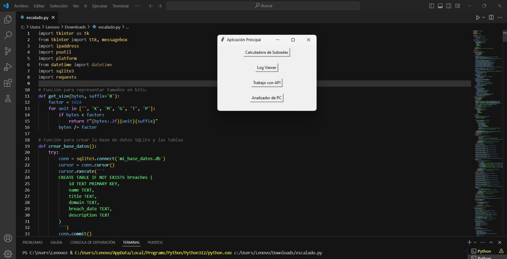
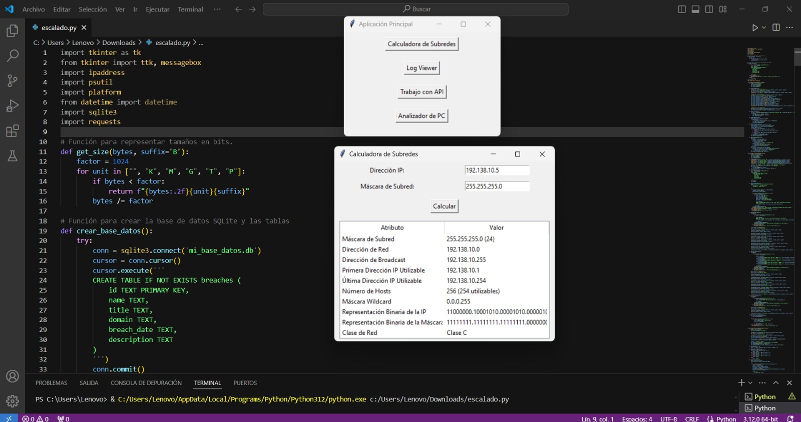
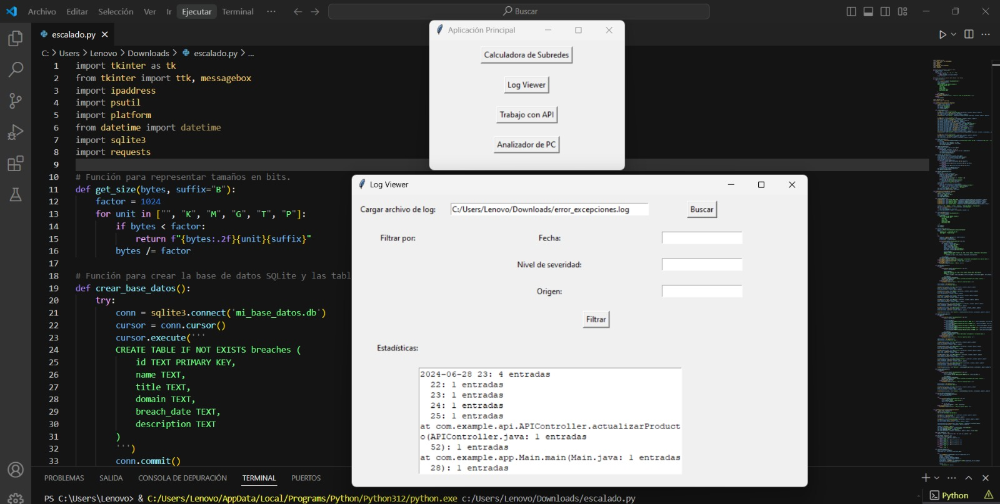
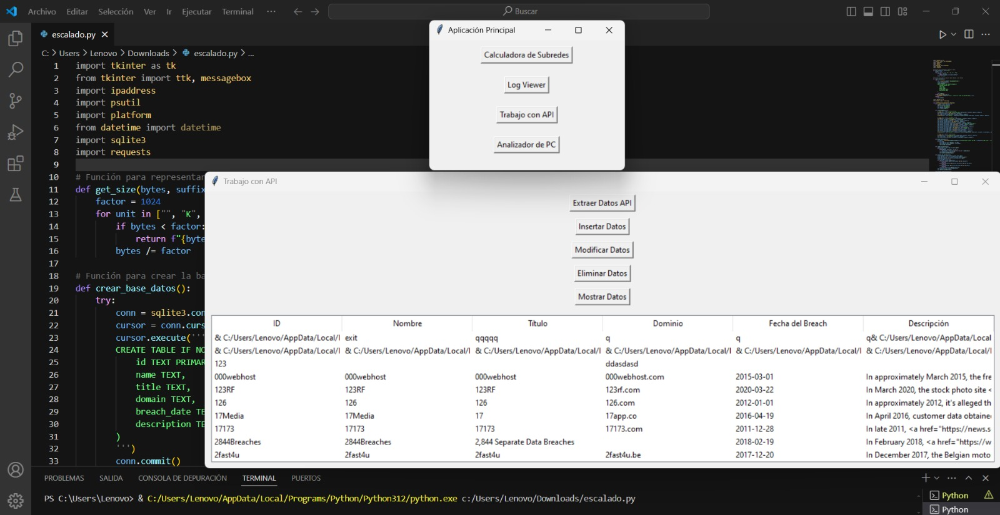
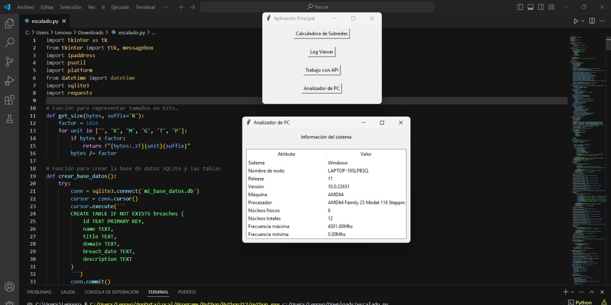

# Programación Básica para Redes
**Ciclo 2 C-20**

## Integrantes:
- Andy Josué Atajo Medina
- Moisés Daniel Pérez Mendoza
- Abraham Manrique Gamarra
- Kevin Santos Huaihua

## Docente:
- Mauricio Surco

## Creación de una Interfaz con Visual Studio Code y Tkinter

### 1. Introducción
Este proyecto consiste en el desarrollo de una aplicación de escritorio multifuncional utilizando Python y la biblioteca `tkinter`. La aplicación incluye funcionalidades avanzadas para la gestión de logs, la interacción con la API de "Have I Been Pwned" (HIBP) para la gestión de datos de brechas de seguridad, y una calculadora de subredes. Este informe detalla la arquitectura del código, las funcionalidades implementadas y las consideraciones de diseño.

### 2. Objetivos del Proyecto
- Desarrollar una interfaz gráfica de usuario (GUI) para visualizar y filtrar archivos de logs.
- Implementar la interacción con una API externa para manejar datos de brechas de seguridad.
- Construir una calculadora de subredes para calcular atributos esenciales de una red basada en una dirección IP y máscara de subred proporcionadas por el usuario.
- Asegurar la robustez y eficiencia del código a través de un diseño modular y buenas prácticas de programación.

### 3. Descripción del Código

#### 3.1. Importación de Bibliotecas
El código hace uso de varias bibliotecas estándar y de terceros:
- `tkinter`: Para la creación de la interfaz gráfica.
- `tkinter.filedialog`: Para diálogos de selección de archivos.
- `tkinter.messagebox`: Para la visualización de mensajes emergentes.
- `requests`: Para realizar solicitudes HTTP a la API de HIBP.
- `ipaddress`: Para manipulación de direcciones IP.
- `sqlite3`: Para la gestión de la base de datos SQLite.
- `os` y `sys`: Para operaciones del sistema y manejo de rutas.

#### 3.2. Funciones Auxiliares

- `get_size`:

```python
def get_size(size_bytes):
    if size_bytes == 0:
        return "0B"
    size_name = ("B", "KB", "MB", "GB", "TB")
    i = int(math.floor(math.log(size_bytes, 1024)))
    p = math.pow(1024, i)
    s = round(size_bytes / p, 2)
    return "%s %s" % (s, size_name[i])
```
- `crear_base_datos`:
```python
def crear_base_datos():
    with sqlite3.connect("pwned.db") as conexion:
        cursor = conexion.cursor()
        cursor.execute('''CREATE TABLE IF NOT EXISTS breaches (
            id INTEGER PRIMARY KEY,
            Name TEXT,
            Title TEXT,
            Domain TEXT,
            BreachDate TEXT,
            AddedDate TEXT,
            ModifiedDate TEXT,
            PwnCount INTEGER,
            Description TEXT,
            DataClasses TEXT,
            IsVerified INTEGER,
            IsFabricated INTEGER,
            IsSensitive INTEGER,
            IsRetired INTEGER,
            IsSpamList INTEGER,
            IsMalware INTEGER
            )
```

#### 3.3. Clases de Subformularios
-SubFormularioLogViewer:
    Esta clase gestiona la funcionalidad del visor de logs.
    
    Cargar Archivo de Log: Permite al usuario seleccionar y cargar un archivo de log.
    Filtrar Logs: Proporciona opciones para filtrar las entradas de log por fecha, nivel de severidad y origen.
    Mostrar Estadísticas: Muestra estadísticas basadas en los logs filtrados.
-SubFormularioTrabajoAPI:

    Esta clase maneja la interacción con la API de HIBP y la base de datos SQLite.
    Extracción de Datos: Recupera datos de brechas de seguridad utilizando la API de HIBP.
    Gestión de la Base de Datos: Permite insertar, modificar, eliminar y mostrar datos de brechas en la base de datos.
-SubFormularioCalculadoraSubred:

    Esta clase realiza cálculos de subredes.
    Cálculo de Atributos de Subred: Calcula y muestra atributos como la dirección de red, máscara de subred, dirección de broadcast, primera y última dirección utilizable, máscara de comodín y número     de hosts.
### 4. Implementación de Funcionalidades
#### 4.1. Visor de Logs
 
- Carga de Archivos:
  
```python
    self.boton_cargar_archivo = tk.Button(self, text="Cargar Archivo", command=self.cargar_archivo)
    self.boton_cargar_archivo.pack(pady=10)
```
- Filtrado de Entradas:
```python
    self.filtro_severidad = tk.StringVar(self)
    self.filtro_severidad.set("Seleccionar Severidad")
    self.menu_filtro_severidad = tk.OptionMenu(self, self.filtro_severidad, "INFO", "WARNING", "ERROR")
    self.menu_filtro_severidad.pack(pady=5)
```
- Estadísticas:
```python
    self.texto_estadisticas = tk.Text(self, height=10, width=50)
    self.texto_estadisticas.pack(pady=10)
```
#### 4.2. Trabajo con API
-Interacción con la API de HIBP:
```python
url = "https://haveibeenpwned.com/api/v3/breaches"
headers = {"hibp-api-key": api_key}
response = requests.get(url, headers=headers)
```
-Gestión de la Base de Datos:
```python
with sqlite3.connect("pwned.db") as conexion:
    cursor = conexion.cursor()
    cursor.execute("INSERT INTO breaches (...) VALUES (...)", (data))
```
#### 4.3. Calculadora de Subredes
-Cálculo de Atributos:
```python
import ipaddress

def calcular_subred(ip, mascara):
    red = ipaddress.IPv4Network(f"{ip}/{mascara}", strict=False)
    return {
        "dirección_red": red.network_address,
        "dirección_broadcast": red.broadcast_address,
        "primera_dirección": list(red.hosts())[0],
        "última_dirección": list(red.hosts())[-1],
        "num_hosts": red.num_addresses - 2
    }
```
### 5. Resultados Obtenidos
-Visor de Logs: El visor de logs permite cargar y filtrar grandes archivos de logs eficientemente, proporcionando estadísticas detalladas y facilitando la identificación de problemas.
-Trabajo con API: La interacción con la API de HIBP y la gestión de la base de datos permite mantener una base de datos actualizada de brechas de seguridad, con capacidades completas de CRUD.
-Calculadora de Subredes: La calculadora de subredes proporciona información detallada sobre las subredes, lo cual es crucial para la planificación y gestión de redes.
### 6. Recomendaciones y Mejoras
-Seguridad de la API: Utilizar técnicas de almacenamiento seguro para claves API, como variables de entorno o gestores de secretos.
-Optimización del Procesamiento de Logs: Implementar técnicas más avanzadas para el procesamiento y filtrado de logs, especialmente para archivos de gran tamaño.
-Validación de Entradas: Incluir validaciones exhaustivas para las entradas del usuario, asegurando la integridad y correcta interpretación de los datos ingresados.
-Documentación y Comentarios: Ampliar la documentación del código y agregar comentarios detallados para mejorar la mantenibilidad y facilitar futuras mejoras.
-Manejo de Errores: Mejorar el manejo de errores y excepciones, especialmente en operaciones críticas como el acceso a la base de datos y las solicitudes HTTP.
### 7. Conclusión
El proyecto ha logrado implementar una aplicación de escritorio robusta y multifuncional, que integra de manera efectiva la visualización y filtrado de logs, la interacción con la API de HIBP para la gestión de datos de brechas de seguridad, y una calculadora de subredes completa. Con las recomendaciones propuestas, la aplicación puede ser aún más eficiente, segura y fácil de mantener, proporcionando una herramienta valiosa para la gestión de redes y la seguridad informática.

### Capturas del funcionamiento del código y la interfaz gráfica

#### Pantalla de inicio


#### Calculadora de subredes


#### Visor de archivo de log


#### Trabajo con API


#### Analizador de PC


#### Enlace GitHub:
https://github.com/Kevin-Santos-Huaihua/trabajo_final.git

#### Enlace YouTube:
https://youtu.be/AoxXIJsNucc?si=-AdyVfxMV1oaxGpV
